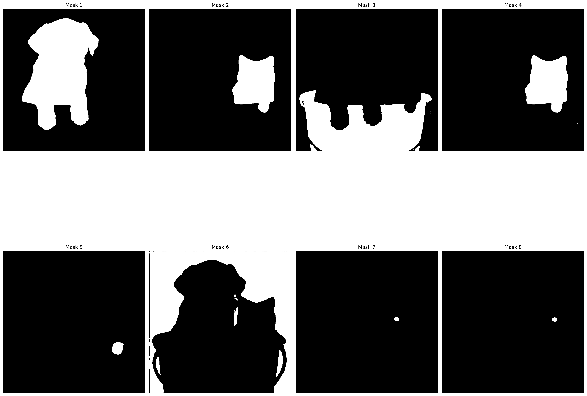

# Amazon Titan Image Generator v2 Application

本リポジトリでは，以下に示す Amazon Titan Image Generator v2 の全機能を利用可能な streamlit アプリケーションと，SAM2 によるセグメンテーション実行用の Jupyter Notebook を公開している．

- Amazon Titan Image Generator v2 の全機能を利用するための[アプリケーションの実装](https://github.com/ren8k/aws-bedrock-titan-image-generator-app/blob/main/src/app/app.py)
- [Segment Anything Model 2 (SAM 2)](https://github.com/facebookresearch/segment-anything-2) を利用したセグメンテーションマスク生成用の [Jupyter Notebook](https://github.com/ren8k/aws-bedrock-titan-image-generator-app/blob/main/notebook/automatic_mask_generator_example.ipynb)

> [!NOTE]
> Amazon Titan Image Generator v2 の解説記事を Qiita に投稿しております．
> 是非そちらもご覧下さい！
>
> - [Amazon Titan Image Generator v2 の全機能を徹底検証：機能解説と実践ガイド](https://qiita.com/ren8k/items/94b5d9bdc513acde371e)
> - [上記記事で利用した検証用 Jupyter Notebook](https://github.com/ren8k/aws-bedrock-titan-image-generator-app/blob/main/notebook/verify_all_features_of_titan_image_generator_v2.ipynb)


> Amazon Titan Image Generator v2 の全機能が利用可能な streamlit アプリケーション

| 入力画像                                          | セグメンテーションマスク画像                            |
| ------------------------------------------------- | ------------------------------------------------------- |
|  |  |

> SAM2 によるセグメンテーション実行結果

## 検証環境

以下の環境で動作確認済みである．AWS を利用する場合，G5 インスタンスなどを推奨する．

- OS: Ubuntu 22.04.4 LTS
- CPU: Intel(R) Core(TM) i9-12900K
- RAM: 64GB
- GPU: NVIDIA GeForce RTX 3090

> [!IMPORTANT]
> アプリケーションの実行には GPU は不要である．SAM2 を利用する場合，上記のような GPU リソースが必要となる．

## 環境構築

VSCode の Dev Container を利用する．

> [!IMPORTANT]
> nvidia-driver が install された GPU の利用を必須としている．アプリケーションのみを実行する場合，実行環境に以下が install されていれば，Dev Container は不要である．
>
> - 基本的なライブラリ (streamlit, boto3, Pillow など)
> - Python (3.11 以上が望ましい)
>
> SAM2 を利用する場合，PyTorch，CUDA などの環境構築が必要となるため，Dev Container の利用を推奨する．

## Amazon Titan Image Generator v2 のアプリケーション実行方法

```bash
cd src/app
bash run_app.sh
```

## SAM2 の実行方法

- Dev Conatiner でコンテナを起動しログインする．
  - ctrl + shift + p でコマンドパレットを開き，`Dev-Containers: Rebuild Container` を選択する．
- [`./notebook/automatic_mask_generator_example.ipynb`](https://github.com/ren8k/aws-bedrock-titan-image-generator-app/blob/main/notebook/automatic_mask_generator_example.ipynb)を実行する．
